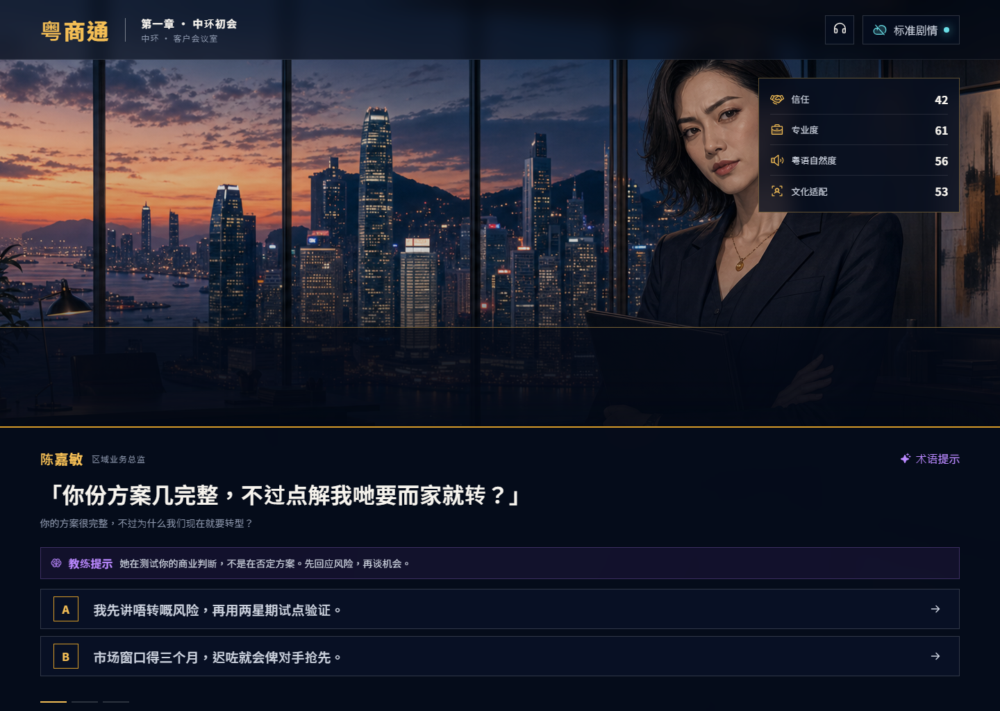

# 粤商通 CantoneseBiz

[](https://github.com/dragon-zhang-woo/cantonese-biz-galgame/actions/workflows/ci.yml)
[](https://github.com/dragon-zhang-woo/cantonese-biz-galgame/releases/latest)
[](LICENSE)

**在香港职场真实关系中练习商务粤语的 AI 互动视觉小说。**

[本地运行](#本地运行) ·
[下载 v1.0.0](https://github.com/dragon-zhang-woo/cantonese-biz-galgame/releases/tag/v1.0.0) ·
[3 分钟演示脚本](docs/demo-script.md) ·
[参赛说明](PROJECT_SUBMISSION.md)



普通语言学习产品教你“怎么说”；粤商通进一步训练你在不同权力关系、
沟通渠道与时间压力下“怎么把事情说成”。玩家的表达会触发人物反应、
关系变化与可解释复盘，而不是只得到一句语法评分。

本项目是 **2026 火鸟 AI 黑客松开放赛道**的原创可运行作品。

## 三种训练入口

| 入口 | 适合体验 | 主要能力 |
| --- | --- | --- |
| **电影式主线** | 快速理解产品与世界观 | 五幕固定故事图、人物关系后果、结局学习画像；无网络也可完整通关 |
| **训练手册** | 针对具体职场任务练习 | 12 项独立任务，可按关系、技能、压力、难度和渠道筛选 |
| **我的真实情境** | 带入自己的工作难题 | 浏览器先脱敏，生成 3–6 轮训练；完成两轮后可随时收口复盘 |

首页另提供 **3 分钟评委演示**：依次覆盖五幕主线、12 项训练、可编辑的
预置现实情境、第四幕后果对比与学习复盘；不调用模型、不写主线存档，
退出后原进度保持不变。

覆盖的任务包括：澄清需求、协商优先级、沟通坏消息、表达异议、柔性跟进、
范围控制、会议纪要、个人资料边界、利益冲突、纠正性反馈与高层汇报。

## AI 如何参与

```text
玩家选择或自由作答
        │
        ├── 浏览器 SpeechRecognition：桌面 Chrome/Edge 实验性实时粤语字幕
        ├── 港话通 Speech：用官方 HTTP 识别把录音转成可编辑文字
        ├── DeepSeek：在人物、利益与当前关系约束下生成 NPC 反应
        ├── 港话通：独立检查自然度、礼貌度、商务适配并给出港式改写
        └── 程序：校验输出、限制分数变化、控制故事节点与失败回退
```

AI 负责难以穷举的角色表演和语境解释；程序始终掌握故事图、训练边界、
数值变化和存档。任何一个模型、网络或额度不可用时，系统都会明确显示来源并
回退到本地内容，不中断训练。

## 核心特性

- **关系后果可见**：追踪信任、专业度、粤语自然度与文化适配，并用人物反应和
  剧情证据解释变化；
- **自由表达**：主线、12 项训练和自定义情境均支持键盘、麦克风录音与
  录音上传；桌面 Chrome/Edge 可显示实验性实时字幕，停录后可由港话通
  整段转写兜底，文字确认后才提交双模型；
- **任务导向复盘**：按目标清晰、具体性、主人翁意识、关系维护、风险透明和
  下一步六个维度评分，并提供可复用句式；
- **来源可追溯**：训练技能与香港劳工处、平机会、私隐专员公署和廉政公署等
  官方资料绑定；
- **隐私最小化**：真实情境先在浏览器脱敏；原文、自由作答和 API 密钥不写入
  主线存档；音频只进专用 IndexedDB，最多 20 条、30 天，并可随时下载或清空；
- **稳定演示**：标准剧情与预写训练路径完全离线可用，支持本机断点恢复；
- **响应式体验**：覆盖桌面与 390px 手机布局，并提供浏览器粤语朗读。

## 推荐演示路径

1. 打开“我的真实情境”，输入一段不含真实姓名和机构的职场难题；
2. 展示脱敏回执、编排来源、置信度、技能卡和可修正设置；
3. 自由回答两轮，对比 DeepSeek 人物反应与港话通语言反馈；
4. 主动收口，查看六维量表、港式改写和现实复用模板；
5. 返回首页打开“3 分钟评委演示”，按五段导览直接录制完整产品路径。

完整现场方案见 [`docs/demo-script.md`](docs/demo-script.md)。

## 技术架构

```text
React 19 + Vite 6
├── 五幕主线与 12 项训练任务（确定性本地数据）
├── 自定义情境（浏览器脱敏、进度与行为量表）
├── UtteranceInput（浏览器实时字幕、录音、上传、可编辑转写与 IndexedDB）
└── FastAPI
    ├── POST /api/game/turn
    │   ├── DeepSeek Provider
    │   └── HKChat Provider
    ├── POST /api/scenario/compose
    │   └── 受控模板、技能卡与来源编排
    └── /api/speech/transcriptions
        └── 港话通 Speech Adapter（官方 JSON/Base64 文件识别；流式守门）
```

后端通过 Pydantic 验证结构化输出，并为两类模型提供独立降级和短期内存缓存。
详细设计见 [`docs/architecture.md`](docs/architecture.md)。

## 本地运行

需要 Node.js 22+；AI 模式另需 Python 3.12+。

### 1. 启动前端

```bash
npm ci
npm run dev
```

访问 `http://localhost:5173`。不启动后端也能体验标准剧情和本地训练路径。

### 2. 启动 AI 后端

```bash
cd backend
python -m venv .venv
```

Windows PowerShell：

```powershell
.\.venv\Scripts\python -m pip install -r requirements.txt
Copy-Item .env.example .env
.\.venv\Scripts\python -m uvicorn app.main:app --reload --port 8000
```

macOS / Linux：

```bash
./.venv/bin/python -m pip install -r requirements.txt
cp .env.example .env
./.venv/bin/python -m uvicorn app.main:app --reload --port 8000
```

若要调用真实双模型，请在 `backend/.env` 填写 `DEEPSEEK_API_KEY` 与
`HKCHAT_API_KEY`。完整 Provider、模型与 CORS 设置均有注释写在
[`backend/.env.example`](backend/.env.example) 中。前端默认连接
`http://localhost:8000`；可在根目录 `.env.local` 中通过
`VITE_API_BASE_URL` 修改。

港话通 [Studio Speech](https://hkgai-studio.prod.hkchat.app/zh-Hans/modelhub/speech)
已确认文件识别使用 Bearer 鉴权，并以 JSON/Base64 调用
`/server_proxy/api/v1/speech_recognize`；填写 `HKCHAT_SPEECH_API_KEY` 即可启用
上传与停止后转写。Studio 当前只公布 TTS WebSocket，没有实时 ASR 契约，
因此 `HKCHAT_SPEECH_WS_URL` 默认留空，服务端能力中的 `live_supported=false`
只表示港话通流式识别未开启，绝不以轮询整段录音伪装流式识别。桌面版会在
Chrome/Edge 支持时使用浏览器 Web Speech API 提供实验性实时粤语字幕；这条
客户端路径不需要项目 API Key，但浏览器可能把语音发送到其云端识别服务，
产品会在首次使用前明确告知。识别失败时，完整录音仍保留并自动尝试一次
港话通整段转写。没有任何语音能力时，录音仍可在本机下载，键盘和离线训练
完全不受影响。

如需向主办方申请实时 ASR 契约，可直接使用
[`docs/hkchat-live-asr-contract-request.md`](docs/hkchat-live-asr-contract-request.md)
中的最小问题清单和验收标准。

### Docker Compose

先复制 `backend/.env.example` 为 `backend/.env`，然后运行：

```bash
docker compose up --build
```

Web 位于 `http://localhost:8080`，API 位于 `http://localhost:8000`。

## 测试与构建

```bash
npm run lint
npm test
npm run build

cd backend
pytest

cd ..
docker build --tag cantonese-biz-web:local .
docker build --tag cantonese-biz-api:local ./backend
```

GitHub Actions 会在提交到 `develop`、`main` 及相关 Pull Request 时执行同类
前后端检查，并构建 Web 与 API 两个容器镜像。Docker build context 会排除
本机密钥、虚拟环境、测试输出和未跟踪文档。

## 发行版与容器

正式版本发布在 [GitHub Releases](https://github.com/dragon-zhang-woo/cantonese-biz-galgame/releases)。
每个版本包含可直接部署的静态 Web ZIP 与 SHA-256 校验文件。

```bash
docker pull ghcr.io/dragon-zhang-woo/cantonese-biz-galgame:1.0.0
docker pull ghcr.io/dragon-zhang-woo/cantonese-biz-galgame-api:1.0.0
```

- [Web 容器软件包](https://github.com/dragon-zhang-woo/cantonese-biz-galgame/pkgs/container/cantonese-biz-galgame)
- [API 容器软件包](https://github.com/dragon-zhang-woo/cantonese-biz-galgame/pkgs/container/cantonese-biz-galgame-api)

Web 镜像监听 80 端口，API 镜像监听 8000 端口。推送 `vX.Y.Z` 标签后，
发布工作流会自动验证项目、生成静态包，并发布语义版本与 `latest` 镜像。

## 项目结构

| 路径 | 内容 |
| --- | --- |
| `src/App.jsx` | 游戏主状态与体验编排 |
| `src/components/` | 主线、训练库、自定义情境与复盘界面 |
| `src/data/` | 五幕剧情、12 项任务、人物与来源数据 |
| `src/services/` | API、脱敏、评分与本机存档 |
| `backend/app/` | FastAPI、双模型编排、校验与回退 |
| `public/assets/` | 原创场景、角色与剧情视觉资产 |
| `docs/` | 架构、演示、训练规格与视觉生产记录 |

## 安全、原创与许可证

- 产品用于语言与职场文化练习，不提供法律、投资、医疗或雇佣决策；
- AI 反馈是情境化学习建议，不宣称存在唯一正确的“香港表达”；
- 角色、故事、交互与正式视觉资产均为项目原创，资产记录见
  [`ASSET_SOURCES.md`](ASSET_SOURCES.md)；
- 第三方依赖与许可证见
  [`THIRD_PARTY_NOTICES.md`](THIRD_PARTY_NOTICES.md)；
- 项目代码采用 [MIT License](LICENSE)。
