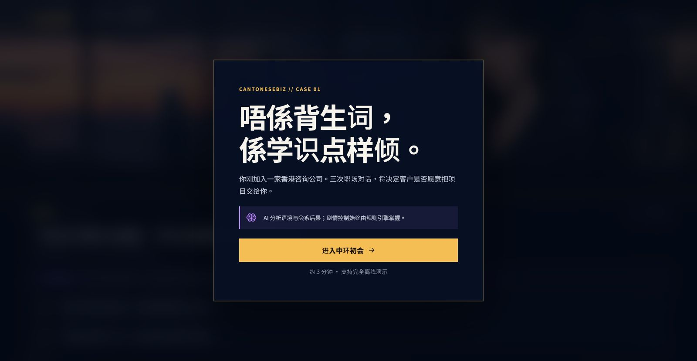
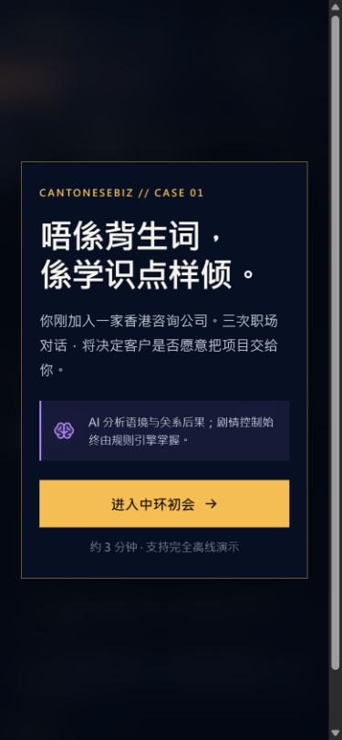
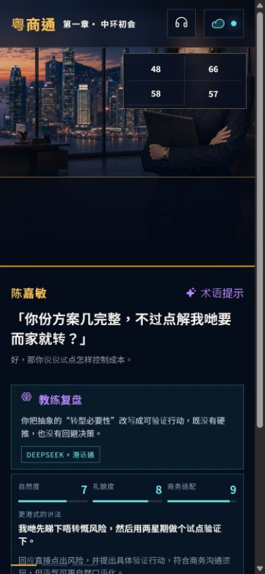

# 2026-07-22 产品流程审计

## 总体结论

现有视觉小说的品牌感、主舞台层级和离线金线已经健康。审计发现的
最高风险不在视觉，而在 AI 主路径：前端原先 8.5 秒即中止请求，导致
真实港话通结果无法抵达界面。修复后，结果态能明确展示
`DeepSeek + 港话通`、三项本地化评分和港式改写。

## 流程步骤

1. **进入介绍页 — 健康**

   

   一句话价值、三分钟时长和离线能力都在首屏内。主 CTA 明确，键盘
   焦点样式可见。限制：截图不能证明完整的屏幕阅读器朗读顺序。

2. **阅读场景并选择回应 — 健康**

   

   角色、地点、状态、教练提示和两个选择形成清楚的决策顺序。NPC
   立绘和香港场景保持主视觉，控制台没有遮住角色面部。

3. **旧 AI 路径返回结果 — 高风险，已修复**

   

   修复前，界面在港话通完成前主动超时，实际结果只能显示“已降级”。
   这会让比赛现场无法证明本地模型深度。

4. **390px 介绍页 — 健康**

   

   CTA、说明和标题在 390px 下完整可读，没有横向溢出。

5. **双模型结果态 — 健康**

   

   修复后同时展示角色后果、模型来源、自然度、礼貌度、商务适配和
   港式改写。信息密度增加，但桌面端仍保留清晰的主次层级。

6. **390px 双模型结果态 — 可用，需滚动**

   

   结果内容没有横向溢出；评分与改写可读。由于复盘信息增加，选项被
   推到首屏以下，需要纵向滚动。后续可以增加“收起复盘”，但不阻塞
   当前核心演示。

## 本轮最高影响改动

- 前端模型等待窗口从 8.5 秒调整为 38 秒；
- 后端改为 DeepSeek 剧情与港话通本地化并行执行；
- 两个模型可分别降级，不再整回合失败；
- 新增本地化三项评分、港式改写和来源标签；
- 相同输入加入 10 分钟内存缓存，重复演示即时返回。

## 证据边界

截图证明可见层级、响应式排版和主流程状态；它不能单独证明完整无障碍
合规、所有浏览器语音可用性或弱网环境下的每一种失败路径。这些需要
自动化测试和现场设备复验。
